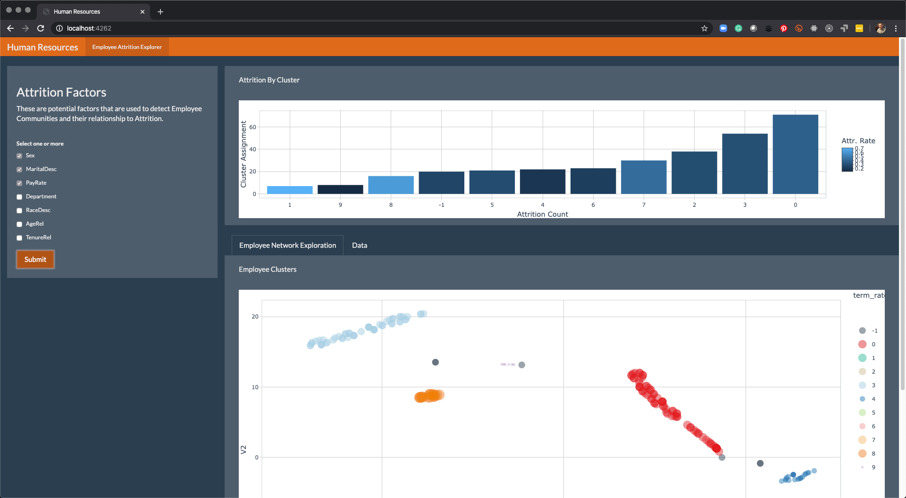

```{r setup, include=FALSE}
knitr::opts_chunk$set(
    echo = TRUE,
    message = FALSE,
    warning = FALSE
)
```


```{r}

# Look at your conda environments
reticulate::conda_list()
# Replace this with your conda environment containing sklearn, pandas, & numpy
reticulate::use_condaenv("py3.9", required = TRUE)
reticulate::py_config()
reticulate::py_numpy_available()
library(reticulate)
  
```

```{python}
1+1
```


# Data Wrangling & Preprocessing (R)

```{r}
library(tidyverse)
library(lubridate)
```


## Data Ingest

```{r}
hr_data_tbl <- read_csv("data/HRDataset_v13.csv")

hr_data_tbl
```

```{r, eval=F}
hr_data_tbl %>% glimpse()
```

## Age and Tenure Features

```{r}
hr_data_tbl <- hr_data_tbl %>%
    # DOB uses two-digit year. All those years are actually from 1900. Use 4-digit year to make sure it doesn't convert years to 2000s. 
    mutate(DOB = paste0(substr(DOB, 1, 6), "19", substr(DOB, 7,8))) %>%
    mutate(AgeRel    = ( mdy(DOB) - min(mdy(DOB), na.rm = TRUE) ) / dyears(1)) %>%
    mutate(TenureRel = ( mdy(DateofHire) - min(mdy(DateofHire), na.rm = TRUE) ) / dyears(1))

hr_data_tbl %>% select(AgeRel, TenureRel)

hr_data_tbl %>%
    ggplot(aes(AgeRel)) +
    geom_histogram()

```


## Subset & Fix Missingness

```{r}
library(DataExplorer)
```


```{r}
hr_data_tbl %>% plot_missing()
```

```{r}
selections <- c(
    "Employee_Name", 
    "Sex", "MaritalDesc", 
    "PayRate", "Department",
    "AgeRel"
    )

hr_subset_tbl <- hr_data_tbl %>%
    select(one_of(selections)) %>%
    # I know this is not ideal but looking at the output of plot_missing() function convinced me that when there is a missing data it is across almost all columns.
    # I will not spend extra time to try to impute missing data
    drop_na()

hr_subset_tbl %>% glimpse()
```

```{r}
hr_subset_tbl %>% plot_missing()
```


## Preprocessing (recipes)

```{r, paged.print = FALSE}
library(recipes)

# Right now data is not ready. We have character data, numeric data that is all over the place in terms of magnitude. Some features would dominate the analysis as we keep the data as is. 
# Normalize the numeric values.
# We will also convert character variables into dummy variables. 
rec_obj <- recipe(~ ., hr_subset_tbl) %>%
    step_rm(Employee_Name) %>%
    step_normalize(all_numeric()) %>%
    step_dummy(all_nominal(), one_hot = FALSE) %>%
    prep()
    
rec_obj
```

```{r}
hr_subset_processed_tbl <- juice(rec_obj)

hr_subset_processed_tbl %>% glimpse()
```

```{r}
hr_subset_processed_tbl %>%
    ggplot(aes(AgeRel)) +
    geom_histogram()
```

```{r}
# Prep for Python
# sklearn utilizes matrix and arrays. 
X <- as.matrix(hr_subset_processed_tbl)

employee_names <- hr_subset_tbl$Employee_Name
```

# Machine Learning (Python)

## Clustering - Python

```{python}
# Data Manipulation
import pandas as pd
import numpy as np
```

### R to Python

```{python}

r.X
```

```{python}
r.hr_subset_processed_tbl
```


```{python}
pd.Series(r.employee_names)
```

### Affinity Propagation

```{python}
# Machine Learning
from sklearn.cluster import AffinityPropagation
```


```{python}
af = AffinityPropagation().fit(r.X)
af
```

```{python}
af.cluster_centers_indices_
```


```{python}
cluster_assignments_af = af.labels_
cluster_assignments_af
```

### DBSCAN

```{python}
from sklearn.cluster import DBSCAN
```

```{python}
db = DBSCAN(min_samples=5).fit(r.X)
db
```

```{python}
cluster_assignments_db = db.labels_
cluster_assignments_db
```


## TSNE Low-Dimensional Embedding - Python

Needed to create a reduced representation of the original data in 2-D space.

```{python}
from sklearn.manifold import TSNE
```

```{python}
X_embedded = TSNE(n_components=2, random_state=123).fit_transform(r.X)

pd.DataFrame(X_embedded)
```

# Py to R

### Getting Scikit-Learn Results in RMarkdown

```{r}
# Affinity Propogation
py$cluster_assignments_af
```

```{r}
# DBSCAN
py$cluster_assignments_db
```

```{r}

X_embedded_tbl <- py$X_embedded %>% as_tibble()
X_embedded_tbl
```

# Visualizations (R)

```{r}
library(plotly)
#library(tidyquant)
```

## Data Preparation

```{r}
employee_clustering_tbl <- tibble(
    Employee_Name = employee_names,
    cluster_af    = py$cluster_assignments_af,
    cluster_db    = py$cluster_assignments_db,
) %>%
    bind_cols(X_embedded_tbl) %>%
    left_join(hr_data_tbl)

employee_clustering_tbl
```


```{r}
attrition_rate_tbl <- employee_clustering_tbl %>%
    select(cluster_db, Termd) %>%
    group_by(cluster_db) %>%
    summarise(
        term_rate  = mean(Termd, na.rm = T),
        term_count = n()
    ) %>%
    arrange(desc(term_rate))

attrition_rate_tbl
```


## Attrition by Cluster Visualization

```{r}
g <- attrition_rate_tbl %>%
    mutate(cluster_db = as_factor(cluster_db) %>% fct_reorder(term_count)) %>%
    ggplot(aes(term_count, cluster_db)) +
    geom_col(aes(fill = term_rate)) +
    theme_classic() +
    labs(title = "Attrition Rate by Employee Cluster",
         fill = "Attr. Rate", x = "Attrition Count", y = "Cluster Assignment")

ggplotly(g)
```

## Cluster Network Visualization - R

```{r}
data_formatted <- employee_clustering_tbl %>%
    left_join(attrition_rate_tbl) %>%
    mutate(description = str_glue("{Employee_Name}
                                  Position = {Position}
                                  MaritalDesc = {MaritalDesc}
                                  Sex = {Sex}
                                  Race = {RaceDesc}
                                  EmpStatusID = {EmpStatusID}
                                  PayRate = {PayRate}
                                  Terminated = {Termd}
                                  Term Reason = {TermReason}
                                  
                                  Cluster Term Rate: {scales::percent(term_rate)}
                                  Cluster Term Count: {term_count}
                                  
                                  ")
    ) %>%
    select(Employee_Name:V2, description, Termd, 
           term_rate, term_count)

g <- data_formatted %>%
    
    ggplot(aes(V1, V2, color = factor(cluster_db))) +
    geom_point(aes(text = description, size = term_rate), alpha = 0.5) +
    #scale_color_tq() +
    theme_classic() +
    # theme(legend.position = "none") + 
    labs(title = "Employee Cluster Assignments", color = "Cluster")
    

ggplotly(g)
```


# Shiny App

## Sourcing Python

```{r}
# In order shiny to be able to process python code you need to package them up.
source_python("py/clustering.py")
source_python("py/tsne.py")
```

```{r}
# Calls def cluster_dbscan() 
cluster_dbscan(X)
```

```{r, warning=F}
# calls def tsne_embedding()
tsne_embedding(X) %>% head()
```

## Integrate into Shiny App!

```{r}

```

